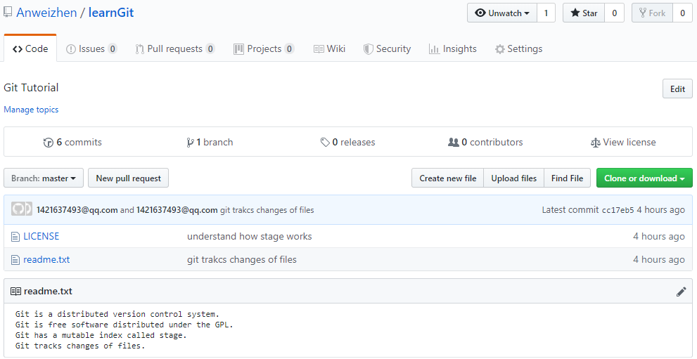

# GIt GitHub使用

## Git简介

> 本文主要参考[廖雪峰](https://www.liaoxuefeng.com/wiki/896043488029600/898732864121440)的Git 教程。

Git是基于C语言开发的分布式版本控制系统。

### 安装GIt

。。。

### 设置账户：

Author: 1421637493@qq.com <Anweizhen>

### 创建版本库

- 第一步：创建仓库

    ```
    Administrator@PC-20171110TWNM MINGW64 ~/Desktop (master)
    $ mkdir learnGit
    
    Administrator@PC-20171110TWNM MINGW64 ~/Desktop (master)
    $ cd learnGit
    
    Administrator@PC-20171110TWNM MINGW64 ~/Desktop/learnGit (master)
    $ pwd
    /c/Users/Administrator/Desktop/learnGit
    ```
    
    `pwd`命令用于显示当前目录。这个仓库位于`/c/Users/Administrator/Desktop/learnGit`。
    
     如果你使用Windows系统，为了避免遇到各种莫名其妙的问题，请确保目录名（包括父目录）不包含中文。

- 第二步：通过`git init`命令把这个目录变成Git可以管理的仓库：

    ```
    Administrator@PC-20171110TWNM MINGW64 ~/Desktop/learnGit (master)
    $ git init
    Initialized empty Git repository in C:/Users/Administrator/Desktop/learnGit/.git/
    ```

    瞬间Git就把仓库建好了，而且告诉你是一个空的仓库（empty Git repository），细心的读者可以发现当前目录下多了一个`.git`的目录，这个目录是Git来跟踪管理版本库的，没事千万不要手动修改这个目录里面的文件，不然改乱了，就把Git仓库给破坏了。

    如果你没有看到`.git`目录，那是因为这个目录默认是隐藏的，用`ls -ah`命令就可以看见。

### 添加文件

首先这里再明确一下，所有的版本控制系统，其实只能跟踪文本文件的改动，比如TXT文件，网页，所有的程序代码等等，Git也不例外。版本控制系统可以告诉你每次的改动，比如在第5行加了一个单词“Linux”，在第8行删了一个单词“Windows”。而图片、视频这些二进制文件，虽然也能由版本控制系统管理，但没法跟踪文件的变化，只能把二进制文件每次改动串起来，也就是只知道图片从100KB改成了120KB，但到底改了什么，版本控制系统不知道，也没法知道。

不幸的是，Microsoft的Word格式是二进制格式，因此，版本控制系统是没法跟踪Word文件的改动的，前面我们举的例子只是为了演示，如果要真正使用版本控制系统，就要以纯文本方式编写文件。

因为文本是有编码的，比如中文有常用的GBK编码，日文有Shift_JIS编码，如果没有历史遗留问题，强烈建议使用标准的UTF-8编码，所有语言使用同一种编码，既没有冲突，又被所有平台所支持。

使用Windows的童鞋要特别注意：建议使用Notepad++。不要Windows自带的**记事本**编辑任何文本文件。原因是Microsoft开发记事本的团队在每个文件开头添加了0xefbbbf（十六进制）的字符来保存UTF-8编码的文件，会导致很多不可思议的问题。

- 第一步：编写一个`readme.txt`文件

    `vim readme.txt` 新建一个文本文件，内容如下：

    ```
    Git is a version control system.
    Git is free software.
    ```

- 第二步：用命令`git add`告诉Git，把文件添加到仓库

    ```
    Administrator@PC-20171110TWNM MINGW64 ~/Desktop/learnGit (master)
    $ vim readme.txt
    
    Administrator@PC-20171110TWNM MINGW64 ~/Desktop/learnGit (master)
    $ git add readme.txt
    warning: LF will be replaced by CRLF in readme.txt.
    The file will have its original line endings in your working directory
    ```

    

- 第三步：用命令`git commit`告诉Git，把文件提交到仓库

    ```
    Administrator@PC-20171110TWNM MINGW64 ~/Desktop/learnGit (master)
    $ git commit -m "wrote a readme.txt file"
    [master (root-commit) 5255c50] wrote a readme.txt file
     1 file changed, 2 insertions(+)
     create mode 100644 readme.txt
    ```

    简单解释一下`git commit`命令，`-m`后面输入的是本次提交的说明，可以输入任意内容，当然最好是有意义的，这样你就能从历史记录里方便地找到改动记录。

    嫌麻烦不想输入`-m "xxx"`行不行？确实有办法可以这么干，但是强烈不建议你这么干，因为输入说明对自己对别人阅读都很重要。实在不想输入说明的童鞋请自行Google，我不告诉你这个参数。

    `git commit`命令执行成功后会告诉你，`1 file changed`：1个文件被改动（新添加的readme.txt文件）；`2 insertions`：插入了两行内容（readme.txt有两行内容）。

    为什么Git添加文件需要`add`，`commit`一共两步呢？因为`commit`可以一次提交很多文件，所以你可以多次`add`不同的文件，比如：

    ```
    $ git add file1.txt
    $ git add file2.txt file3.txt
    $ git commit -m "add 3 files."
    ```

**小结**

- 初始化一个Git仓库，使用`git init`命令

- 添加文件到Git仓库，分两步：

    - 使用命令`git add <file>`，注意，可反复多次使用，添加多个文件；

    - 使用命令`git commit -m <message>`，完成；

## Git使用

### 版本查看

已经成功地添加并提交了一个readme.txt文件，继续修改readme.txt文件，改成如下内容：

```
Git is a distributed version control system.
Git is free software.
```

现在，运行`git status`命令看看结果：

```
$ git status
On branch master
Changes not staged for commit:
  (use "git add <file>..." to update what will be committed)
  (use "git checkout -- <file>..." to discard changes in working directory)

        modified:   readme.txt

no changes added to commit (use "git add" and/or "git commit -a")
```

`git status`命令可以让我们时刻掌握仓库当前的状态，上面的命令输出告诉我们，`readme.txt`被修改过了，但还没有准备提交的修改。


虽然Git告诉我们`readme.txt`被修改了，但如果能看看具体修改了什么内容，自然是很好的。比如你休假两周从国外回来，第一天上班时，已经记不清上次怎么修改的`readme.txt`，所以，需要用`git diff`这个命令看看：

```
$ git diff readme.txt
warning: LF will be replaced by CRLF in readme.txt.
The file will have its original line endings in your working directory
diff --git a/readme.txt b/readme.txt
index 8443d23..9247db6 100644
--- a/readme.txt
+++ b/readme.txt
@@ -1,2 +1,2 @@
-Git is a version control system.
+Git is a distributed version control system.
 Git is free software.
```

`git diff`顾名思义就是查看difference，显示的格式正是Unix通用的diff格式，可以从上面的命令输出看到，我们在第一行添加了一个`distributed`单词。

知道了对`readme.txt`作了什么修改后，再把它提交到仓库就放心多了，提交修改和提交新文件是一样的两步，第一步是`git add`：

```
$ git add readme.txt
```

同样没有任何输出。在执行第二步`git commit`之前，再运行`git status`看看当前仓库的状态：

```
$ git status
On branch master
Changes to be committed:
  (use "git reset HEAD <file>..." to unstage)

        modified:   readme.txt
```

`git status`告诉我们，将要被提交的修改包括`readme.txt`，下一步，就可以放心地提交了：

```
$ git commit -m "add distributed"
[master fed8669] add distributed
 1 file changed, 1 insertion(+), 1 deletion(-)
```

提交后，再用`git status`命令看看仓库的当前状态：

```
$ git status
On branch master
nothing to commit, working tree clean
```

Git告诉我们当前没有需要提交的修改，而且，工作目录是干净（working tree clean）的。

#### 小结

- 要随时掌握工作区的状态，使用`git status`命令。
- 如果`git status`告诉你有文件被修改过，用`git diff`可以查看修改内容。

### 版本回退

再次修改`readme.txt`件如下：

```
Git is a distributed version control system.
Git is free software distributed under the GPL.
```

然后尝试提交，如下：

```
Administrator@PC-20171110TWNM MINGW64 ~/Desktop/learnGit (master)
$ vim readme.txt

Administrator@PC-20171110TWNM MINGW64 ~/Desktop/learnGit (master)
$ git add readme.txt
warning: LF will be replaced by CRLF in readme.txt.
The file will have its original line endings in your working directory

Administrator@PC-20171110TWNM MINGW64 ~/Desktop/learnGit (master)
$ git commit -m "append GPL"
[master 361837c] append GPL
 1 file changed, 1 insertion(+), 1 deletion(-)
```

像这样，你不断对文件进行修改，然后不断提交修改到版本库里，就好比玩RPG游戏时，每通过一关就会自动把游戏状态存盘，如果某一关没过去，你还可以选择读取前一关的状态。有些时候，在打Boss之前，你会手动存盘，以便万一打Boss失败了，可以从最近的地方重新开始。Git也是一样，每当你觉得文件修改到一定程度的时候，就可以“保存一个快照”，这个快照在Git中被称为`commit`。一旦你把文件改乱了，或者误删了文件，还可以从最近的一个`commit`恢复，然后继续工作，而不是把几个月的工作成果全部丢失。

现在，回顾一下`readme.txt`文件一共有几个版本被提交到Git仓库里了：

版本1：wrote a readme file

```
Git is a version control system.
Git is free software.
```

版本2：add distributed

```
Git is a distributed version control system.
Git is free software.
```

版本3：append GPL

```
Git is a distributed version control system.
Git is free software distributed under the GPL.
```

当然了，在实际工作中，我们脑子里怎么可能记得一个几千行的文件每次都改了什么内容，不然要版本控制系统干什么。版本控制系统肯定有某个命令可以告诉我们历史记录，在Git中，我们用`git log`命令查看：

```
$ git log
commit fd6c5cd5329b19a19c643d5550155188266c2e2d (HEAD -> master)
Author: 1421637493@qq.com <Anweizhen>
Date:   Mon Aug 19 10:47:48 2019 +0800

    append GPL

commit fed8669f44bdbb1c630c64e306a6ef116da6ebec
Author: 1421637493@qq.com <Anweizhen>
Date:   Mon Aug 19 10:44:20 2019 +0800

    add distributed

commit 9e4d5d871bfbcf2daf98acc2faf6a306804408a2
Author: 1421637493@qq.com <Anweizhen>
Date:   Mon Aug 19 10:39:02 2019 +0800

    wrote a readme.txt file
```

`git log`命令显示从最近到最远的提交日志，我们可以看到3次提交，最近的一次是`append GPL`，上一次是`add distributed`，最早的一次是`wrote a readme file`。

如果嫌输出信息太多，看得眼花缭乱的，可以试试加上`--pretty=oneline`参数：

```
$ git log --pretty=oneline
fd6c5cd5329b19a19c643d5550155188266c2e2d (HEAD -> master) append GPL
fed8669f44bdbb1c630c64e306a6ef116da6ebec add distributed
9e4d5d871bfbcf2daf98acc2faf6a306804408a2 wrote a readme.txt file
```

需要友情提示的是，看到的一大串类似`fd6c...`的是`commit id`（版本号），和SVN不一样，Git的`commit id`不是1，2，3……递增的数字，而是一个SHA1计算出来的一个非常大的数字，用十六进制表示。为什么`commit id`需要用这么一大串数字表示呢？因为Git是分布式的版本控制系统，后面我们还要研究多人在同一个版本库里工作，如果大家都用1，2，3……作为版本号，那肯定就冲突了。

每提交一个新版本，实际上Git就会把它们自动串成一条时间线。如果使用可视化工具查看Git历史，就可以更清楚地看到提交历史的时间线：


好了，现在我们启动时光穿梭机，准备把`readme.txt`回退到上一个版本，也就是`add distributed`的那个版本，怎么做呢？

首先，Git必须知道当前版本是哪个版本，在Git中，用`HEAD`表示当前版本，也就是最新的提交`1094adb...`（注意我的提交ID和你的肯定不一样），上一个版本就是`HEAD^`，上上一个版本就是`HEAD^^`，当然往上100个版本写100个`^`比较容易数不过来，所以写成`HEAD~100`。

现在，我们要把当前版本`append GPL`回退到上一个版本`add distributed`，就可以使用`git reset`命令：

```
$ git reset --hard HEAD^
HEAD is now at fed8669 add distributed
```

`--hard`参数有啥意义？这个后面再讲，现在你先放心使用。

看看`readme.txt`的内容是不是版本`add distributed`：

```
$ cat readme.txt
Git is a distributed version control system.
Git is free software.
```

果然被还原了。

还可以继续回退到上一个版本`wrote a readme file`，不过且慢，然我们用`git log`再看看现在版本库的状态：

```
Author: 1421637493@qq.com <Anweizhen>
Date:   Mon Aug 19 10:44:20 2019 +0800

    add distributed

commit 9e4d5d871bfbcf2daf98acc2faf6a306804408a2
Author: 1421637493@qq.com <Anweizhen>
Date:   Mon Aug 19 10:39:02 2019 +0800

    wrote a readme.txt file
```

最新的那个版本`append GPL`已经看不到了！好比你从21世纪坐时光穿梭机来到了19世纪，想再回去已经回不去了，肿么办？

办法其实还是有的，只要上面的命令行窗口还没有被关掉，就可以顺着往上找，找到那个`append GPL`的`commit id`是`fd6c5...`，于是就可以指定回到未来的某个版本：

```
$ git reset --hard fd6c5
HEAD is now at fd6c5cd append GPL
```

版本号没必要写全，前几位就可以了，Git会自动去找。当然也不能只写前一两位，因为Git可能会找到多个版本号，就无法确定是哪一个了。

再小心翼翼地看看`readme.txt`的内容：

```
$ cat readme.txt
Git is a distributed version control system.
Git is free software distributed under GPL.
```

果然，我胡汉三又回来了。

Git的版本回退速度非常快，因为Git在内部有个指向当前版本的`HEAD`指针，当你回退版本的时候，Git仅仅是把HEAD从指向`append GPL`：

```ascii
┌────┐
│HEAD│
└────┘
   │
   └──> ○ append GPL
        │
        ○ add distributed
        │
        ○ wrote a readme file
```

改为指向`add distributed`：

```ascii
┌────┐
│HEAD│
└────┘
   │
   │    ○ append GPL
   │    │
   └──> ○ add distributed
        │
        ○ wrote a readme file
```

然后顺便把工作区的文件更新了。所以你让`HEAD`指向哪个版本号，你就把当前版本定位在哪。

现在，你回退到了某个版本，关掉了电脑，第二天早上就后悔了，想恢复到新版本怎么办？找不到新版本的`commit id`怎么办？

在Git中，总是有后悔药可以吃的。当你用`$ git reset --hard HEAD^`回退到`add distributed`版本时，再想恢复到`append GPL`，就必须找到`append GPL`的commit id。Git提供了一个命令`git reflog`用来记录你的每一次命令：

```
$ git reflog
fd6c5cd (HEAD -> master) HEAD@{0}: reset: moving to fd6c5
fed8669 HEAD@{1}: reset: moving to HEAD^
fd6c5cd (HEAD -> master) HEAD@{2}: commit: append GPL
fed8669 HEAD@{3}: commit: add distributed
9e4d5d8 HEAD@{4}: commit (initial): wrote a readme.txt file
```

从输出可知，`append GPL`的commit id是`fd6c5cd`，现在，你又可以乘坐时光机回到未来了。

#### 小结

- `HEAD`指向的版本就是当前版本，因此，Git允许我们在版本的历史之间穿梭，使用命令`git reset --hard commit_id`。
- 穿梭前，用`git log`可以查看提交历史，以便确定要回退到哪个版本。
- 要重返未来，用`git reflog`查看命令历史，以便确定要回到未来的哪个版本。

### 工作区和暂存区

Git和其他版本控制系统如SVN的一个不同之处就是有<font color=red>暂存区</font>的概念。

#### 工作区（Working Directory）

就是在电脑里能看到的目录，比如`learngit`文件夹就是一个工作区：


#### 版本库（Repository）

工作区有一个隐藏目录`.git`，这个不算工作区，而是Git的版本库。

Git的版本库里存了很多东西，其中最重要的就是称为stage（或者叫index）的暂存区，还有Git为我们自动创建的第一个分支`master`，以及指向`master`的一个指针叫`HEAD`。


分支和`HEAD`的概念我们以后再讲。

前面讲了我们把文件往Git版本库里添加的时候，是分两步执行的：

<font color=red> 第一步是用`git add`把文件添加进去，实际上就是把文件修改添加到暂存区</font>；

第二步是用`git commit`提交更改，实际上就是把暂存区的所有内容提交到当前分支。

因为我们创建Git版本库时，Git自动为我们创建了唯一一个`master`分支，所以，现在，`git commit`就是往`master`分支上提交更改。

<font colore=red>可以简单理解为，需要提交的文件修改通通放到暂存区，然后，一次性提交暂存区的所有修改 </font>。

俗话说，实践出真知。现在，我们再练习一遍，先对`readme.txt`做个修改，比如加上一行内容：

```
Git is a distributed version control system.
Git is free software distributed under the GPL.
Git has a mutable index called stage.
```

然后，在工作区新增一个`LICENSE`文本文件（内容随便写）。

```
$ vim LICENSE

Administrator@PC-20171110TWNM MINGW64 ~/Desktop/learnGit (master)
$ ll
total 1
-rw-r--r-- 1 Administrator 197121  0 8月  19 11:31 LICENSE
-rw-r--r-- 1 Administrator 197121 95 8月  19 10:52 readme.txt
```

先用`git status`查看一下状态：

```
$ git status
On branch master
Changes not staged for commit:
  (use "git add <file>..." to update what will be committed)
  (use "git checkout -- <file>..." to discard changes in working directory)

	modified:   readme.txt

Untracked files:
  (use "git add <file>..." to include in what will be committed)

	LICENSE

no changes added to commit (use "git add" and/or "git commit -a")
```

Git非常清楚地告诉我们，`readme.txt`被修改了，而`LICENSE`还从来没有被添加过，所以它的状态是`Untracked`。

现在，使用两次命令`git add`，把`readme.txt`和`LICENSE`都添加后，用`git status`再查看一下：

```
Administrator@PC-20171110TWNM MINGW64 ~/Desktop/learnGit (master)
$ git add readme.txt

Administrator@PC-20171110TWNM MINGW64 ~/Desktop/learnGit (master)
$ git add LICENSE

$ git status
On branch master
Changes to be committed:
  (use "git reset HEAD <file>..." to unstage)

	new file:   LICENSE
	modified:   readme.txt
```

现在，暂存区的状态就变成这样了：


所以，`git add`命令实际上就是把要提交的所有修改放到暂存区（Stage），然后，执行`git commit`就可以一次性把暂存区的所有修改提交到分支。

```
$ git commit -m "understand how stage works"
[master 420e9f2] understand how stage works
 2 files changed, 1 insertion(+)
 create mode 100644 LICENSE
```

一旦提交后，如果你又没有对工作区做任何修改，那么工作区就是“干净”的：

```
$ git status
On branch master
nothing to commit, working tree clean
```

现在版本库变成了这样，暂存区就没有任何内容了：


### 管理修改

掌握了暂存区的概念后，我们要讨论的就是，为什么Git比其他版本控制系统设计得优秀，因为<font color=red>Git跟踪并管理的是修改，而非文件。</font>

你会问，什么是修改？比如你新增了一行，这就是一个修改，删除了一行，也是一个修改，更改了某些字符，也是一个修改，删了一些又加了一些，也是一个修改，甚至创建一个新文件，也算一个修改。

为什么说Git管理的是修改，而不是文件呢？我们还是做实验。第一步，对readme.txt做一个修改，比如加一行内容：

```
$ cat readme.txt
Git is a distributed version control system.
Git is free software distributed under the GPL.
Git has a mutable index called stage.
Git tracks changes.
```

然后，添加：

```
$ git add readme.txt
$ git status
# On branch master
# Changes to be committed:
#   (use "git reset HEAD <file>..." to unstage)
#
#       modified:   readme.txt
#
```

然后，再修改readme.txt：

```
$ cat readme.txt 
Git is a distributed version control system.
Git is free software distributed under the GPL.
Git has a mutable index called stage.
Git tracks changes of files.
```

提交：

```
$ git commit -m "git tracks changes"
[master 519219b] git tracks changes
 1 file changed, 1 insertion(+)
```

提交后，再看看状态：

```
$ git status
On branch master
Changes not staged for commit:
  (use "git add <file>..." to update what will be committed)
  (use "git checkout -- <file>..." to discard changes in working directory)

	modified:   readme.txt

no changes added to commit (use "git add" and/or "git commit -a")
```

咦，怎么第二次的修改没有被提交？

别激动，我们回顾一下操作过程：

第一次修改 -> `git add` -> 第二次修改 -> `git commit`

你看，我们前面讲了，Git管理的是修改，当你用`git add`命令后，在工作区的第一次修改被放入暂存区，准备提交，但是，在工作区的第二次修改并没有放入暂存区，所以，`git commit`只负责把暂存区的修改提交了，也就是第一次的修改被提交了，第二次的修改不会被提交。

提交后，用`git diff HEAD -- readme.txt`命令可以查看工作区和版本库里面最新版本的区别：

```
$ git diff HEAD -- readme.txt 
diff --git a/readme.txt b/readme.txt
index 76d770f..a9c5755 100644
--- a/readme.txt
+++ b/readme.txt
@@ -1,4 +1,4 @@
 Git is a distributed version control system.
 Git is free software distributed under the GPL.
 Git has a mutable index called stage.
-Git tracks changes.          //版本库中最新的
+Git tracks changes of files. //当前readme.txt中的内容
```

可见，第二次修改确实没有被提交。

那怎么提交第二次修改呢？你可以继续`git add`再`git commit`，也可以别着急提交第一次修改，先`git add`第二次修改，再`git commit`，就相当于把两次修改合并后一块提交了：

第一次修改 -> `git add` -> 第二次修改 -> `git add` -> `git commit`

```
$ git add readme.txt

Administrator@PC-20171110TWNM MINGW64 ~/Desktop/learnGit (master)
$ git commit -m "git trakcs changes of files"
[master cc17eb5] git trakcs changes of files
 1 file changed, 1 insertion(+), 1 deletion(-)
```

再次查看不同，结果为空，显然第二次的修改已经提交

```
$ git diff HEAD -- readme.txt
```

#### 小结

现在，你又理解了Git是如何跟踪修改的，每次修改，如果不用`git add`到暂存区，那就不会加入到`commit`中。

### 撤销修改


### 删除文件


## 远程仓库

Git是分布式版本控制系统，同一个Git仓库，可以分布到不同的机器上。怎么分布呢？可以自己搭建一台运行Git的服务器，不过现阶段，为了学Git先搭个服务器绝对是小题大作。好在，有GIthub。

Github是一个提供Git仓库托管服务的网站，所以，只要注册一个GitHub账号，就可以免费获得Git远程仓库。

在进行托管前，需要注册GitHub账号。另外由于本地Git仓库和GitHub仓库之间的传输是通过SSH加密的，所以，需要一点设置：

- 步骤1：添加user name 和email

    ```
    git config --global user.name "yourname"
    git config --global user.email "youremail" 
    ```

    已设置过的，可通过git log命令查看提交日志，日志中有user name 和email

    ```
    $ git log
    commit fd6c5cd5329b19a19c643d5550155188266c2e2d (HEAD -> master)
    Author: 1421637493@qq.com <Anweizhen>
    Date:   Mon Aug 19 10:47:48 2019 +0800
    
        append GPL
    ```

- 步骤2：创建SSH秘钥

    在用户主目录下，看看有没有.ssh目录，如果有，再看看这个目录下有没有`id_rsa`和`id_rsa.pub`这两个文件，如果已经有了，可直接跳到步骤3。

    ```
    $ cd ~/.ssh
    
    $ ls
    id_rsa  id_rsa.pub  known_hosts
    ```

    如果没有，打开Shell（Windows下打开Git Bash），创建SSH Key：

    ```
    $ ssh-keygen -t rsa -C "youremail@example.com"
    ```

    把邮件地址换成你自己的邮件地址，然后一路回车，使用默认值即可，由于这个Key也不是用于军事目的，所以也无需设置密码。

    如果一切顺利的话，可以在用户主目录里找到`.ssh`目录，里面有`id_rsa`和`id_rsa.pub`两个文件，这两个就是SSH Key的秘钥对，`id_rsa`是私钥，不能泄露出去，`id_rsa.pub`是公钥，可以放心地告诉任何人。

    ```
    Administrator@PC-20171110TWNM MINGW64 ~/Desktop/learnGit (master)
    $ cd ~/.ssh
    
    Administrator@PC-20171110TWNM MINGW64 ~/.ssh
    $ ssh-keygen -t rsa -C "1421637493.com"
    Generating public/private rsa key pair.
    Enter file in which to save the key (/c/Users/Administrator/.ssh/id_rsa):
    Enter passphrase (empty for no passphrase):
    Enter same passphrase again:
    Your identification has been saved in /c/Users/Administrator/.ssh/id_rsa.
    Your public key has been saved in /c/Users/Administrator/.ssh/id_rsa.pub.
    The key fingerprint is:
    SHA256:fniHUTYFpRxJibcPqvnnx0CHBbIXrpl/XVk8VfNWphM 1421637493.com
    The key's randomart image is:
    +---[RSA 2048]----+
    |          .o**E.*|
    |          .=+=.==|
    |          ..O+o.=|
    |           B=..o+|
    |        S =o + ..|
    |       . ..+. ...|
    |        oo+ oo. .|
    |        oo ...o  |
    |         ..o..   |
    +----[SHA256]-----+
    ```

- 步骤3：在github上添加ssh公钥

    进入.ssh目录下，使用`vim id_rsa.pub`打开文件，复制序列码，包含（ssh-rsa等标识）。不同操作系统和电脑可能公钥路径不一样，以实际情况为准。

    登录github后，进入个人设置settings--->ssh and gpg keys-->new ssh key ——>粘贴即可（title自行命名）

    

    点“Add Key”，就应该看到已经添加的Key：

    

为什么GitHub需要SSH Key呢？因为GitHub需要识别出你推送的提交确实是你推送的，而不是别人冒充的，而Git支持SSH协议，所以，GitHub只要知道了你的公钥，就可以确认只有你自己才能推送。

当然，GitHub允许你添加多个Key。假定你有若干电脑，你一会儿在公司提交，一会儿在家里提交，只要把每台电脑的Key都添加到GitHub，就可以在每台电脑上往GitHub推送了。

### 添加远程库

现在的情景是，你已经在本地创建了一个Git仓库后，又想在GitHub创建一个Git仓库，并且让这两个仓库进行远程同步，这样，GitHub上的仓库既可以作为备份，又可以让其他人通过该仓库来协作，真是一举多得。

首先，登陆GitHub，然后，在右上角找到“Create a new repo”按钮，创建一个新的仓库：


在Repository name填入`learngit`，其他保持默认设置，点击“Create repository”按钮，就成功地创建了一个新的Git仓库：


目前，在GitHub上的这个`learngit`仓库还是空的，GitHub告诉我们，可以从这个仓库克隆出新的仓库，也可以把一个已有的本地仓库与之关联，然后，把本地仓库的内容推送到GitHub仓库。

现在，根据GitHub的提示，在本地的`learngit`仓库下运行命令：

```
$ git remote add origin git@github.com:michaelliao/learngit.git
```

请千万注意，把上面的`michaelliao`替换成你自己的GitHub账户名，否则，你在本地关联的就是我的远程库，关联没有问题，但是你以后推送是推不上去的，因为你的SSH Key公钥不在我的账户列表中。

添加后，远程库的名字就是`origin`，这是Git默认的叫法，也可以改成别的，但是`origin`这个名字一看就知道是远程库。

下一步，就可以把本地库的所有内容推送到远程库上：（这一步可能会遇到Permission denied (publickey)，后面有介绍）

```
$ git push -u origin master
Counting objects: 20, done.
Delta compression using up to 4 threads.
Compressing objects: 100% (15/15), done.
Writing objects: 100% (20/20), 1.64 KiB | 560.00 KiB/s, done.
Total 20 (delta 5), reused 0 (delta 0)
remote: Resolving deltas: 100% (5/5), done.
To github.com:michaelliao/learngit.git
 * [new branch]      master -> master
Branch 'master' set up to track remote branch 'master' from 'origin'.
```

把本地库的内容推送到远程，用`git push`命令，实际上是把当前分支`master`推送到远程。

由于远程库是空的，我们第一次推送`master`分支时，加上了`-u`参数，Git不但会把本地的`master`分支内容推送的远程新的`master`分支，还会把本地的`master`分支和远程的`master`分支关联起来，在以后的推送或者拉取时就可以简化命令。

推送成功后，可以立刻在GitHub页面中看到远程库的内容已经和本地一模一样：



从现在起，只要本地作了提交，就可以通过命令：

```
$ git push origin master
```

把本地`master`分支的最新修改推送至GitHub，现在，你就拥有了真正的分布式版本库！

### 从远程库克隆

上节内容，讲了先有本地库，后有远程库的时候，如何关联远程库。现在，假设我们从零开发，那么最好的方式是先创建远程库，然后，从远程库克隆。

首先，登陆GitHub，创建一个新的仓库，名字叫`gitskill`：


勾选`Initialize this repository with a README`，这样GitHub会自动为我们创建一个`README.md`文件。创建完毕后，可以看到`README.md`文件：


现在，远程库已经准备好了，下一步是用命令`git clone`克隆一个本地库：

```
Administrator@PC-20171110TWNM MINGW64 ~/Desktop/learnGit (master)
$ git clone git@github.com:Anweizhen/gitSkill.git
Cloning into 'gitSkill'...
Warning: Permanently added the RSA host key for IP address '192.30.255.113' to the list of known hosts.
remote: Enumerating objects: 3, done.
remote: Counting objects: 100% (3/3), done.
Receiving objects: 100% (3/3), done.
remote: Total 3 (delta 0), reused 0 (delta 0), pack-reused 0
```

然后进入`gitskills`目录看看，已经有`README.md`文件了：

```
Administrator@PC-20171110TWNM MINGW64 ~/Desktop/learnGit (master)
$ cd gitSkill

Administrator@PC-20171110TWNM MINGW64 ~/Desktop/learnGit/gitSkill (master)
$ ls
README.md

```

如果有多个人协作开发，那么每个人各自从远程克隆一份就可以了。

你也许还注意到，GitHub给出的地址不止一个，还可以用`https://github.com/michaelliao/gitskills.git`这样的地址。实际上，Git支持多种协议，默认的`git://`使用ssh，但也可以使用`https`等其他协议。

使用`https`除了速度慢以外，还有个最大的麻烦是每次推送都必须输入口令，但是在某些只开放http端口的公司内部就无法使用`ssh`协议而只能用`https`。

**小结**

- 要克隆一个仓库，首先必须知道仓库的地址，然后使用`git clone`命令克隆。
- Git支持多种协议，包括`https`，但通过`ssh`支持的原生`git`协议速度最快。


## 分支管理

To update

## 标签管理

To update

## 自定义Git

To update


## 参考

[廖雪峰——Git教程](https://www.liaoxuefeng.com/wiki/896043488029600/898732864121440)